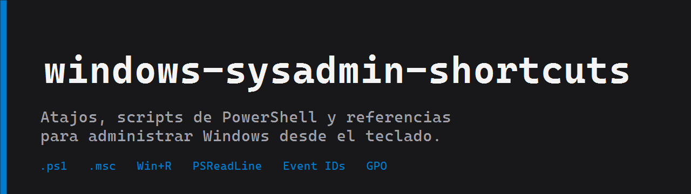
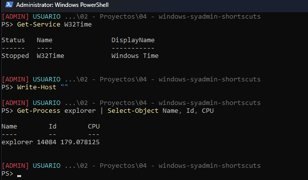
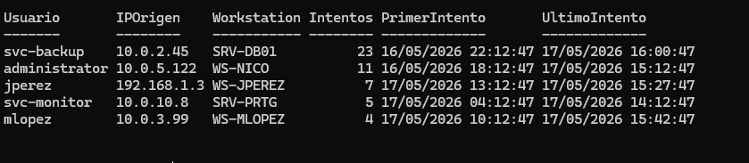

# windows-sysadmin-shortcuts

Atajos, comandos y scripts en PowerShell que uso para administrar Windows
sin pasar tres veces por el mouse. Lo que tengo cargado en mi laptop de
trabajo, ordenado para encontrarlo rapido.

No es una lista generica de Stack Overflow ni un copy-paste de un curso.
Son las cosas que termine usando todas las semanas en clientes reales.

## Por que existe esto

Cuando hay un incidente en un servidor Windows, los primeros tres
minutos definen como sigue todo. Esos minutos los perdes abriendo
menues para llegar a eventvwr, buscando como filtrar por EventID, o
intentando recordar el comando del Win+R para abrir el firewall
avanzado.

La mayoria de las "guias de productividad" para sysadmins repiten lo
basico (Win+R, Ctrl+Alt+Del). Lo util aparece despues: las consolas
MMC menos obvias, los EventIDs que importan en una respuesta a
incidentes, los scripts de PowerShell que devuelven objetos en vez
de strings parseables.

## Estructura

- [`atajos/`](atajos/) tablas de referencia: consolas MMC, comandos del Win+R, atajos del teclado de Windows y de PSReadLine.
- [`powershell/`](powershell/) scripts del dia a dia. Consola admin, exportar logs, detectar logons fallidos, reiniciar servicios con timeout.
- [`seguridad/`](seguridad/) bloqueo de estacion, cierre de sesiones RDP, politica de bloqueo por inactividad.
- [`perfil/`](perfil/) mi `$PROFILE` de PowerShell, con prompt que marca `[ADMIN]` y PSReadLine con prediccion por historial.
- [`docs/`](docs/) versiones extendidas de las tablas y un cheatsheet de Event IDs de Security agrupados por dominio.

## Como lo uso yo

### Cargar el perfil de una

En vez de copiar y pegar el contenido del `$PROFILE`, lo sourceo desde el
repo. Asi cuando actualizo el repo (`git pull`), todas mis terminales
nuevas ya tienen lo ultimo.

```powershell
notepad $PROFILE
# y agregar una linea con la ruta al perfil del repo:
. 'C:\repos\windows-sysadmin-shortcuts\perfil\Microsoft.PowerShell_profile.ps1'
```

El prompt me marca `[ADMIN]` en rojo cuando la sesion esta elevada. Asi
no me equivoco de ventana cuando tengo cuatro abiertas.



### Atajos que uso todos los dias

| Para | Atajo |
|---|---|
| Bloquear la estacion antes de levantarme del escritorio | `Win + L` |
| Abrir Task Manager directo (sin pasar por Ctrl+Alt+Del) | `Ctrl + Shift + Esc` |
| Abrir cualquier consola .msc | `Win + R`, escribir el nombre, Enter |
| Abrir cualquier consola .msc como admin | `Win + R`, escribir el nombre, `Ctrl + Shift + Enter` |
| Visor de eventos en una pestaña filtrada | `eventvwr.msc /c:"Custom View"` |

Tabla completa en [`atajos/teclado-windows.md`](atajos/teclado-windows.md).

### Recoleccion rapida de logs

Detectar intentos de logon fallidos agrupados por usuario, IP y workstation
de la ultima hora:

```powershell
.\powershell\Get-FailedLogons.ps1 -Minutes 60 -MinAttempts 3 | Format-Table -AutoSize
```



Snapshot a evtx + csv de Security, System y Application antes de cerrar
una investigacion:

```powershell
.\powershell\Export-LocalLogs.ps1 -Hours 24 -OutputPath D:\evidencia
```

Para entender que EventIDs estas viendo, [`docs/cheatsheet-eventos.md`](docs/cheatsheet-eventos.md)
tiene la lista agrupada por dominio (autenticacion, cuentas, grupos,
servicios, politica/auditoria, sistema, defender) con severidad sugerida.

## Requisitos

- Windows 10 o 11 (algunos scripts asumen 10 en adelante por Windows Terminal)
- PowerShell 5.1 o 7 (el repo esta probado en ambas, hay un par de cosas que se degradan en 5.1 y estan marcadas en cada script)
- Permisos de admin local para todos los scripts de `seguridad/` y la mayoria de `powershell/`
- Modulo PSReadLine (viene incluido)
- Opcional: RSAT para las consolas de Active Directory (`dsa.msc`, `dssite.msc`, etc.)

## Aviso

Revisa los scripts antes de correrlos. Estan pensados para mi flujo y
para entornos que conozco. En tu infraestructura puede haber GPOs que
los pisen, baselines distintos, o requerimientos que no contemple.

Si lo vas a usar en produccion, abri el archivo, lee las 30 lineas y
adaptalo.

## Licencia

MIT, ver [LICENSE](LICENSE).
